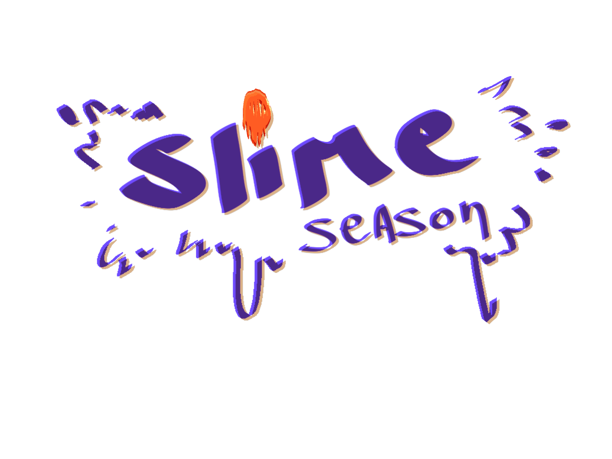

# Slime Season

### Developed by: Lucas Galli



**Slime Season** is an arcade game based on the famous mobile game flappy bird.

You control a wizard, and the most important event of the year finally started, SLIME SEASON! destroy as many slimes as possible to gain points and be the greatest slime hunter of them all! 

## Controls

You navigate the screens using the **Mouse** or you can also press **Escape** to go back to exit or pause the game

#### PRESS RIGHT CLICK TO MOVE TO THE MOUSE POSITION

#### PRESS LEFT CLICK TO SHOOT TOWARDS THE MOUSE POSITION

## Features
```
**confortable movement**

**difficulty curve**
```

## How to Download

First, download the SlimeSeason.zip file, either from the releases page in <a href="https://github.com/Movious0207/Slime_Season/releases">GitHub</a> or in <a href=>itch.io</a>

then, unzip the file and open the .exe

finally, enjoy!

## Credits

#### Ui-Sound FX

All Sound Effects made By me using <a href="https://www.bfxr.net">bfxr</a>

#### Music

 Game Music by <a href="https://pixabay.com/es/music/video-juegos-game-music-loop-19-153393/">Gaston A-P</a> from <a href="https://pixabay.com//?utm_source=link-attribution&utm_medium=referral&utm_campaign=music&utm_content=153393">Pixabay</a>

 Menu Music by <a href="https://pixabay.com/es/music/video-juegos-game-music-loop-18-153392/">Gaston A-P</a> from <a href="https://pixabay.com/music//?utm_source=link-attribution&utm_medium=referral&utm_campaign=music&utm_content=153392">Pixabay</a>

#### Art 

All of the art was made by <a href = "https://birritadulce.itch.io">Angie Tabasso</a> estudiante de primer año de arte y animacion para videojuegos.